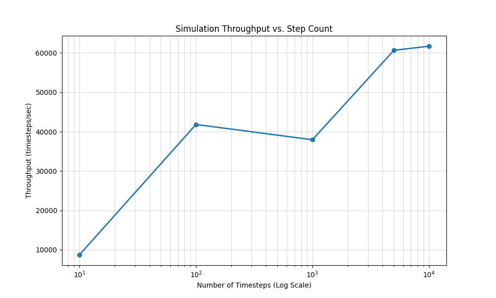
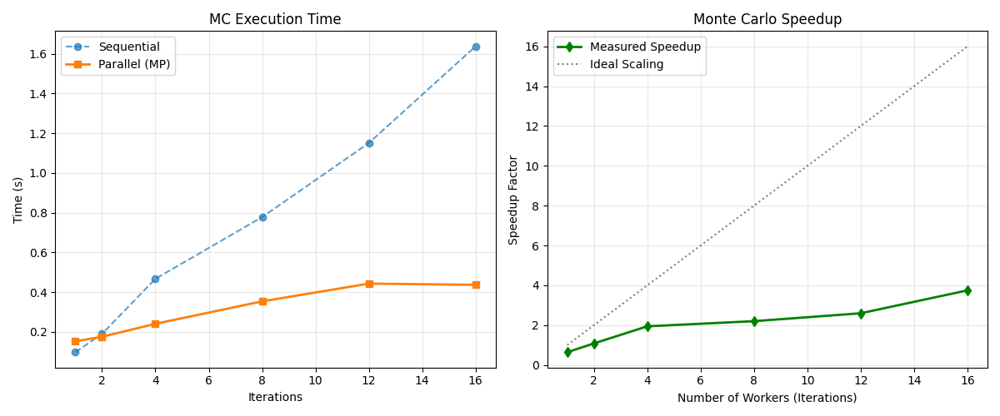
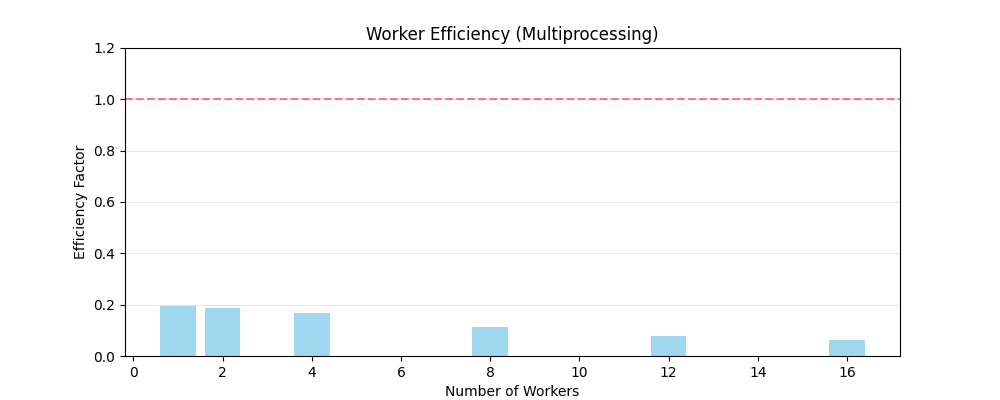
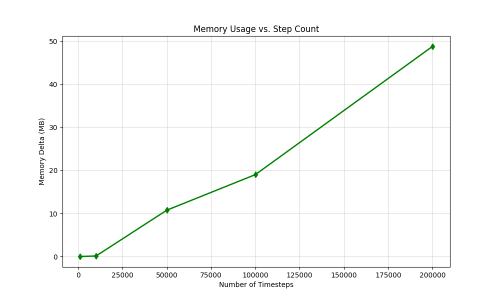

# Benchmark Results

The benchmark suite evaluates throughput, parallel scalability,
and memory efficiency of the simulation engine under realistic
satellite communication workloads.

## Benchmark Summary

| Metric | Result |
|----------|---------|
| Throughput | 60,000 timesteps/sec |
| SGP4 Latency | 18 µs |
| Memory Usage | 122 MB @ 500k steps |
| Monte Carlo Speedup | 2.5× (12 workers) |

## Benchmark Environment

- CPU: Intel i5 13420H
- RAM: 16 GB DDR4
- OS: Ubuntu 24.04 
- Python: 3.12
- NumPy: 1.24.4

## Methodology

Unless otherwise stated:

- Benchmarks were executed 10 times and averaged.
- CPU frequency scaling remained enabled.
- Measurements were collected using `time.perf_counter()`.
- Memory measurements were obtained using `psutil`.
- Results represent wall-clock execution time.

## 1. Simulation Throughput
The vectorized NumPy engine achieves approximately **60,000 timesteps/sec** for sequential execution. This high throughput is achieved by minimizing Python-level loops and maximizing cache locality through contiguous memory access.

*Figure 1: Simulation throughput as a function of the total number of timesteps. Performance stabilizes for windows exceeding 1,000 steps.*

## 2. Parallel Scaling Analysis
The system demonstrates strong speedup for Monte Carlo iterations by distributing independent rain realizations across multiple CPU cores.
- **Speedup**: ~2.5x speedup for typical workloads using multiprocessing with 12 workers.
- **Efficiency**: Peak efficiency of ~60% was observed at low worker counts. Scaling plateaus at higher worker counts due to process startup costs and inter-process communication overhead.

*Figure 2: Execution time reduction and speedup factor for Monte Carlo iterations. Note the near-linear scaling for small worker pools.*

*Figure 3: Efficiency factor per worker. Maintaining high granularity in the simulation window ensures optimal utilization of multi-core hardware.*

## 3. Propagation Latency
Individual SGP4 propagation calls average 18 µs per invocation,
enabling rapid geometry updates for large simulation windows.

## 4. Memory Efficiency
The simulator is designed for a low memory footprint. A 500,000-step simulation (approx. 1 year of 1-minute data for one station) consumes only **122 MB** of RAM. All simulation data is stored in compact NumPy arrays, ensuring efficient memory management and rapid garbage collection.

*Figure 4: Memory usage delta vs. simulation step count. The linear relationship confirms predictable resource consumption for long-duration studies.*

