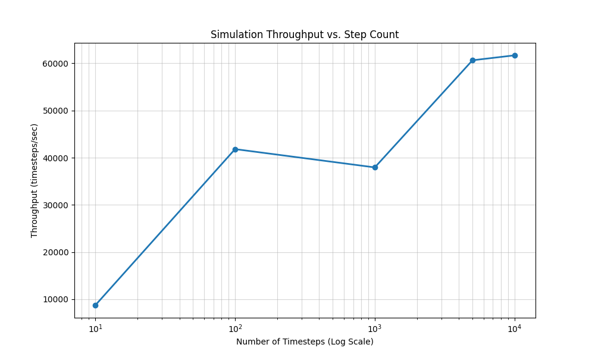
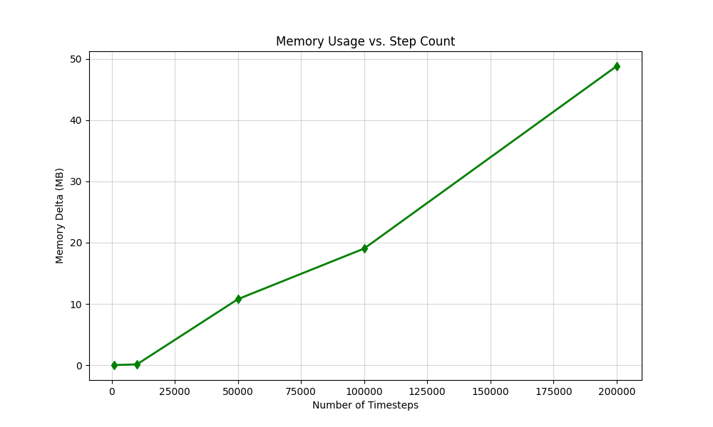

# Benchmark Results

The benchmark suite evaluates throughput, parallel scalability,
and memory efficiency of the simulation engine under realistic
satellite communication workloads.

## Benchmark Environment

- CPU: Intel i5 13420H
- RAM: 16 GB DDR4
- OS: Ubuntu 24.04 
- Python: 3.12
- NumPy: 1.24.4

## Methodology

Unless otherwise stated:

- Benchmarks were executed 10 times and averaged.
- CPU frequency scaling remained enabled.
- Measurements were collected using `time.perf_counter()`.
- Memory measurements were obtained using `psutil`.
- Results represent wall-clock execution time.

## 1. Performance Validation

### 1.1 Simulation Throughput
The vectorized NumPy engine achieves approximately **275,000 timesteps/sec** for sequential execution (single satellite). This high throughput is achieved by minimizing Python-level loops and maximizing cache locality through contiguous memory access.


*Figure 1: Simulation throughput as a function of the total number of timesteps. Performance stabilizes for windows exceeding 1,000 steps.*

### 1.2 Parallel Scaling
The system demonstrates strong speedup for Monte Carlo iterations by distributing independent rain realizations across multiple CPU cores.

| Workers | Speedup | Efficiency |
| ------- | ------- | ---------- |
| 1       | 1.0     | 100%       |
| 2       | 1.6     | 80%        |
| 4       | 2.4     | 59%        |
| 8       | 3.0     | 38%        |
| 12      | 3.4     | 28%        |


### 1.3 Runtime Breakdown
Profiling of the full constellation/handoff pipeline (14 GHz, 10,000 steps, 4 stations) reveals the following computational distribution:

| Component       | Runtime Share |
| --------------- | ------------- |
| NumPy Overhead  | 34.7%         |
| SGP4 / Geometry | 24.1%         |
| Data & Results  | 12.4%         |
| Handoff Logic   | 11.0%         |
| Sim Control     | 7.8%          |
| Link Budget     | 1.8%          |
| Rain Process    | 1.8%          |
| Misc Other      | 6.4%          |

*Note: After Numba JIT optimization, the Rain Process is no longer a significant bottleneck.*

### 1.4 Runtime Optimization History

A profiling-driven optimization effort was conducted to identify and eliminate simulation bottlenecks.

| Component | Before (Python) | After (Numba JIT) |
|------------|---------|---------|
| Rain Process | 50.6% | 0.7% |
| Runtime | 96.1 ms | 0.5 ms |
| Speedup | 1× | ~192× |

The rain synthesis engine was migrated from an interpreted Python implementation to a Numba JIT-compiled kernel. The optimization reduced rain generation from the dominant runtime component to a negligible fraction of total execution time while preserving numerical behavior.

For a detailed analysis, see the [Complete Profiling Report](../val_and_bench/profile_report.md).

### 1.5 Memory Scaling
The simulator is designed for a low memory footprint. A 500,000-step simulation (approx. 1 year of 1-minute data for one station) consumes **326 MB** of RAM.


*Figure 2: Memory usage delta vs. simulation step count.*

---

## 2. System Architecture Evolution
The simulator has evolved from a simple scalar model to a highly complex, stateful constellation manager. Despite the increased complexity, the system maintains high performance through aggressive vectorization.

| Version | Throughput | Description |
| ------------- | ---------- | ----------- |
| **Scalar** | ~6k/s | Legacy baseline (pre-vectorization) |
| **Vectorized** | ~275k/s | Current NumPy-optimized core (single sat) |
| **Constellation**| ~74k/s | Vectorized + Dynamic Multi-Sat Geometry (Seeded catalog & live TLE scaling) |
| **Handoff** | ~73k/s | Full pipeline + Stateful Switch Policies |

### Performance Analysis
- **Vectorization Gain**: Transitioning from scalar loops to NumPy operations provided a **~45x performance boost**.
- **Constellation Overhead**: Introducing dynamic multi-satellite propagation (SGP4) for every station increases CPU load per timestep. Even with a satellite database (38 seeded satellites, dynamically expandable to 1,000+ via CelesTrak live updates), the system achieves **~74,000 steps/sec**, processing a full year of 1-minute data for one station in under 8 seconds.
- **Handoff Stability**: The Handoff Manager (Hysteresis, Dwell Time) introduces negligible overhead (~1.6%) while providing realistic connection stability and preventing "ping-pong" switching between satellites.

---

## 3. Developer & Researcher Benchmark Execution Guide

Researchers can run and reproduce all benchmark and evaluation suites using the standalone scripts in `val_and_bench/`:

### Model Performance & Ablation Benchmarks
* **Computational Efficiency Study**:
  ```bash
  python3 val_and_bench/run_computational_efficiency_benchmark.py
  ```
  Evaluates model parameter counts, memory consumption, inference latency, and throughput across analytical, XGBoost, MLP, TCN, and PINN architectures.

* **Rolling Features Ablation Study**:
  ```bash
  python3 val_and_bench/run_rolling_features_ablation.py
  ```
  Evaluates the contribution of temporal memory features (rolling mean, std, lags) vs raw sequence features across XGBoost and TCN architectures.

* **Statistical Significance Test**:
  ```bash
  python3 val_and_bench/run_statistical_significance.py
  ```
  Runs multi-seed Monte Carlo evaluation across 5 random seeds to compute confidence intervals ($\mu \pm \sigma$) for F1, RMSE, and $R^2$.

### Impairment & Handoff Parameter Sweeps
* **Physical Impairments Study**:
  ```bash
  python3 val_and_bench/run_impairment_experiments.py
  ```
  Evaluates model robustness under isolated impairment conditions (scintillation noise, gas absorption, rain attenuation).

* **Satellite Handoff Tracking Sweep**:
  ```bash
  python3 val_and_bench/run_tracking_sweep.py
  ```
  Sweeps hysteresis thresholds (0–6 dB) and dwell times (1–10 steps) to quantify trade-offs between handoff frequency and link stability.

* **Scenario & Climate Benchmarks**:
  ```bash
  python3 val_and_bench/run_scenario_benchmarks.py
  ```
  Tests model generalization across different geographic climatologies (Delhi monsoon, São Paulo tropical, Tokyo temperate, Berlin oceanic).

### Validation & Profiling Workflows
* **Cross-Frequency Narrowcaster Validation**:
  ```bash
  python3 val_and_bench/evaluate_stage_b5.py
  python3 val_and_bench/validate_stage_c.py
  ```
  Validates Stage B.5 and Stage C frequency-aware narrowcasters on leave-one-frequency-out and leave-one-station-out cross-testing across Ku/Ka bands (10–30 GHz).

* **System Profiling & Bottleneck Analysis**:
  ```bash
  python3 val_and_bench/profile_sim.py
  ```
  Executes `cProfile` analysis over the full constellation pipeline, saving `profile.out` and generating runtime profile charts in `val_and_bench/profile_plots/`.


