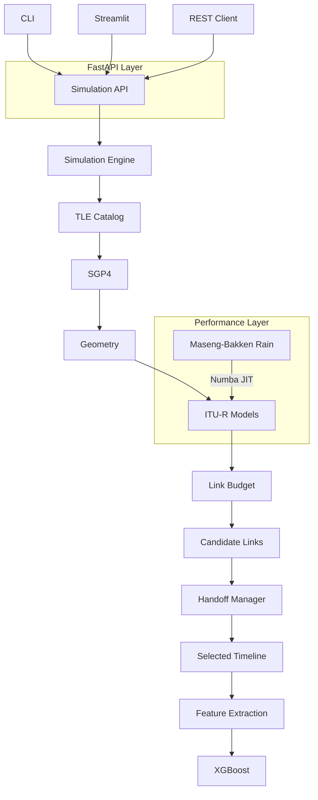
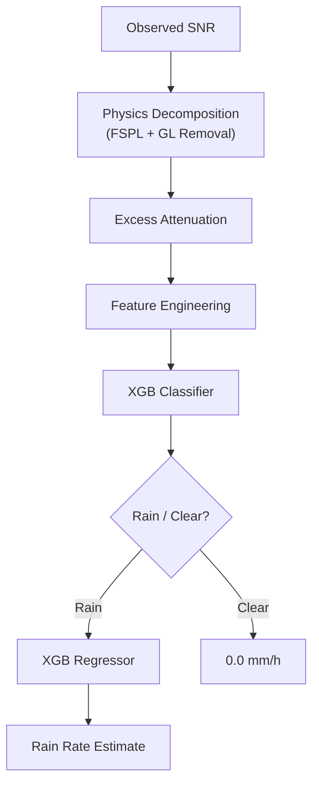

# Combined Documentation: Physics-Informed Rain Rate Narrowcasting

This document aggregates all system documentation and specifications, removing redundant sections while preserving complete technical details, formulas, configurations, API schemas, and validation results.

---

## 1. README (Project Overview & Quick Start)

### Project Overview
A physics-first satellite communication simulator and machine learning narrowcasting framework for inferring rainfall intensity from satellite link telemetry.

### What Problem Does This Solve?
Satellite communication systems continuously observe signal degradation caused by rain attenuation. This project investigates whether rainfall intensity can be reconstructed directly from satellite link telemetry.

The repository contains:
1. **A High-Fidelity Physics Simulator**: Dynamic orbital propagation and atmospheric fade modeling.
2. **A Rain Attenuation Modeling Framework**: Formulates analytical and statistical models for signal decay.
3. **A Machine Learning Narrowcaster**: Classifier-regressor cascade reconstructing rain rates.
4. **A Validation Suite**: Quantitative comparisons against theoretical ITU-R and real-world NASA GPM data.

### Highlights
- **Physics-informed rain-rate narrowcaster**: Reconstructs rainfall intensity from observed SNR.
- **0.28 mm/h RMSE** across 10–30 GHz communication bands.
- **0.999 F1 rain detection** separating tropospheric scintillation from rain.
- **Cross-frequency generalization framework**: High-fidelity transfer.
- **NASA GPM climatology validation**: Multi-decade GPM benchmarking.
- **Corrected stochastic rain generator biases** in the simulation engine.
- **Dynamic multi-satellite handoff simulation**: Elev/SNR stateful switches.
- **1,300+ satellite database** with live TLE updates from CelesTrak.

### Research Contributions
- **Rain Rate Narrowcasting**: Developed a frequency-aware machine learning pipeline (Stage C) that infers rainfall intensity directly from satellite link telemetry across communication bands.
- **Simulator Validation**: Discovered and corrected two biases in the stochastic rain generator (Quantile Probit Fitting Bias and Temporal Markov Reset Bias).
- **Climatology Analysis**: Compared theoretical ITU-R P.837-7 climatology maps against NASA GPM IMERG multi-decade observations, identifying that ITU-R significantly underestimates extreme monsoon rainfall.

### Quick Start
```bash
# 1. Install the package in editable mode
pip install -e .

# 2. Update satellite database with live TLEs
satlinksim-update

# 3. RUN AS A SERVICE (Recommended)
# Terminal 1: Start the API server
satlinksim api

# Terminal 2: Start the UI and select "REST API (Remote)" execution mode
satlinksim ui

# 4. Terminal 2: Or run a simulation directly via REST CLI
satlinksim simulate --steps 3600 --freq 28e9 --output results.json

# 5. Run tests & validation
python3 -m pytest
python3 val_and_bench/validation_correctness.py
```

### Docker Usage
**Using Docker Build:**
```bash
docker build -t satlinksim .
docker run -p 8501:8501 satlinksim
```
**Using Docker Compose:**
```bash
docker-compose up
```
The dashboard will be available at `http://localhost:8501`.

---

## 2. System Architecture

The simulator is designed for scalable simulation workloads through vectorization, concurrency, and parallel execution. It operates as a high-fidelity time-series engine, bridging the gap between orbital mechanics and link-layer performance.

### Architecture Diagram


### Core Modules (Clean Architecture)
The codebase follows a Clean Architecture layout to strictly separate domain physics from application orchestration and external infrastructure:
- **`src/satlinksim/domain/`**: Contains pure physical models, link budget math, geometric transformations, and core data structures (`models.py`). No external dependencies.
- **`src/satlinksim/application/`**: Contains the `SimulationEngine`, orchestrating domain logic to fulfill batched, concurrent, and Monte Carlo simulation requests.
- **`src/satlinksim/infrastructure/api/`**: The RESTful service layer.
    - `server.py`: FastAPI server exposing the simulation engine.
    - `schemas.py`: Pydantic V2 models for JSON serialization and validation.
    - `client.py`: High-level Python client for consuming the REST API.
- **`src/satlinksim/infrastructure/`**: Handles other external integrations, including the Streamlit dashboard (`ui/`), SGP4 TLE propagation (`tle/`), database persistence (`persistence/`), and ML model training/inference (`ml/`).

### Service Architecture (REST API)
1. **FastAPI Server**: Exposes endpoints such as `/api/v1/simulations` accepting structured JSON requests and returning timeseries results.
2. **Unified Entry Point**: The `satlinksim` CLI:
    - `satlinksim api`: Start the backend service.
    - `satlinksim ui`: Launch the interactive dashboard.
    - `satlinksim simulate`: Execute simulation via the REST API.
3. **Data Integrity**: Enforced via Pydantic V2 schemas.
4. **Remote Execution Mode**: The Streamlit UI can act as a thin client to the API server.

### High-Performance Engineering
- **Numba JIT Compilation**: The Maseng-Bakken AR(1) rain synthesis engine is JIT-compiled into a machine-code kernel, achieving a **~192x speedup** over interpreted Python.
- **NumPy Vectorization**: Link budget and atmospheric calculations are processed as matrix operations.
- **Async Concurrency**: Coordinates concurrent propagation workflows for multi-station simulations.
- **Multiprocessing**: Monte Carlo iterations are distributed across CPU cores using `ProcessPoolExecutor`.

### The Timestep Simulation Loop
For each timestep in the simulation window:
1. **Propagate**: Update candidate satellite ECEF states using SGP4 orbital kernels.
2. **Handoff**: Evaluate switching logic (Hysteresis/Dwell) to select the optimal active satellite.
3. **Geometry**: Recompute range, elevation, and Doppler shift for the selected satellite.
4. **Atmospheric Models**: Evaluate frequency- and angle-dependent losses (FSPL, Gas, Scintillation).
5. **Rain Dynamics**: Advance the Maseng-Bakken correlated rain process (AR(1)) using a JIT-accelerated kernel.
6. **Link Budget**: Consolidated SNR calculation.
7. **Aggregate**: Collect time-series metrics.

---

## 3. Physics Models & Technical Reference

The simulator computes a full link budget at each time step. The received Signal-to-Noise Ratio (SNR) is:
$$\text{SNR} = \text{EIRP} - \text{FSPL} - L_{\text{gas}} - L_{\text{rain}} - L_{\text{scint}} + G_{\text{rx}} - N$$
where every term is in decibels (dB) or dBW.

### 1. Dynamic Orbital Geometry (SGP4)
- **SGP4 Propagation**: Fetches the latest TLE from `satellites.db` and propagates to the current epoch.
- **ECEF State**: Propagator returns position $(x, y, z)$ and velocity vectors in Earth-Centered, Earth-Fixed coordinates.
- **Topocentric Transformation**: ECEF vectors are converted into ENU (East-North-Up) coordinates relative to the ground station's WGS84 geodetic position to calculate Elevation, Slant Range, and Azimuth.
- **Doppler Dynamics**: Radial velocity $v_{\text{radial}}$ is computed, giving Doppler shift $f_D = (v_{\text{radial}} / c) \cdot f_c$.

### 2. Free-Space Path Loss (FSPL)
$$\text{FSPL(dB)} = 92.45 + 20\log_{10}(f_{\text{GHz}}) + 20\log_{10}(d_{\text{km}})$$

### 3. Thermal Noise Power
$$N = k_B \cdot T_{\text{sys}} \cdot B$$
In dBW:
$$\text{N(dBW)} = -228.6 + 10\log_{10}(T_{\text{sys}}) + 10\log_{10}(B)$$
where $k_B$ is Boltzmann's constant, $T_{\text{sys}}$ is the system noise temperature (K), and $B$ is the bandwidth (Hz).

### 4. Rain Statistics (ITU-R P.837-7)
Extracts exceedance probability parameters ($R_{0.01}$, $R_{0.1}$, and $P_{\text{rain}}$) to parameterize lognormal rain distribution parameters ($\mu_{\ln}, \sigma_{\ln}$).

### 5. Rain Attenuation Coefficients (ITU-R P.838-3)
Specific attenuation $\gamma_R$ (dB/km) is calculated using:
$$\gamma_R = k \cdot R^\alpha$$
where $k$ and $\alpha$ depend on frequency and polarization (oblate raindrop scaling is interpolated from ITU tables).

### 6. Rain Height (ITU-R P.839-4)
Calculates rain height $h_R$ (above which precipitation is ice/snow and produces negligible attenuation) based on latitude $\phi$.

### 7. Effective Slant Path & Path Reduction (ITU-R P.618-13)
The slant distance $L_s$ through a rain column of height $(h_R - h_s)$ is:
$$L_s = \frac{h_R - h_s}{\sin(El)}$$
For low elevations, path reduction factor $r$ is applied to get effective path length $L_{\text{eff}} = L_s \cdot r$.

### 8. Total Path Rain Attenuation
$$A_{\text{rain}} = \gamma_R \cdot L_{\text{eff}} = k \cdot R^\alpha \cdot L_{\text{eff}}\quad\text{[dB]}$$

### 9. Gaseous Absorption (ITU-R P.676-12)
Computes zenith dry air and water vapor attenuation scaled by $1/\sin(El)$.

### 10. Tropospheric Scintillation (ITU-R P.618-13)
Amplitude fluctuations modeled as zero-mean Gaussian noise with standard deviation $\sigma_s$ calculated from antenna size, elevation, and wet refractivity.

### 11. Temporally Correlated Rain (Maseng-Bakken / ITU-R P.1853)
Rain is modeled as a two-layer stochastic process:
- **Layer 1 (Rain Occurrence)**: A two-state Markov chain (Clear / Raining).
  - Transition probabilities:
    $$p_{\text{onset}} = 1 - \exp(-\Delta t / \tau_{\text{clear}})$$
    $$p_{\text{clear}} = 1 - \exp(-\Delta t / \tau_{\text{rain}})$$
    where $\tau_{\text{rain}} = \tau_c = 300\text{ s}$ (correlation coherence time).
- **Layer 2 (Rain Intensity)**: While in the raining state, the log-rain-rate $\ln(R)$ evolves as an AR(1) autoregressive process:
  $$\ln(R[t]) = \rho \ln(R[t-1]) + \sqrt{1-\rho^2} \sigma_{\ln} N(0,1) + (1-\rho)\mu_{\ln}$$
  The autocorrelation coefficient $\rho = \exp(-\Delta t / \tau_c) \approx 0.819$ (for 60s step size).
  This model reproduces realistic event persistence (5-30 minutes), gradual fade ramp-up/down, station-specific severity, and long-run climatological statistics consistent with exceedance probabilities.

### 12. Packet Loss Model
SNR is mapped to packet loss probability using a sigmoid function centered at the Ku-band DVB-S2 floor (10 dB):
$$P_{\text{loss}} = \frac{1}{1 + \exp(0.8 \cdot (\text{SNR} - 10))}$$

---

## 4. Inverse Rain Rate Modeling & Narrowcasting

### Comparative Model Performance
Narrowcasting infers rain rate from observed signal telemetry. 

#### Rain Detection Performance (Classification at 0.1 mm/h threshold)
| Model | Precision | Recall | F1 Score |
| :--- | :---: | :---: | :---: |
| **Analytical Inversion (Stage A)** | 9.0% | 86.7% | 0.163 |
| **XGBoost Cascade (Stage B)** | 99.96% | 99.82% | 0.999 |
| **Frequency-Aware XGBoost (Stage C)** | 99.98% | 99.92% | 0.999 |

#### Rain Rate Estimation Performance (Regression during rain)
| Model | RMSE (mm/h) | MAE (mm/h) | Correlation | R² |
| :--- | :---: | :---: | :---: | :---: |
| **Analytical Inversion (Stage A)** | 2.10 | 0.76 | 0.346 | 0.111 |
| **XGBoost Cascade (Stage B)** | 0.49 | 0.06 | 0.997 | 0.995 |
| **Frequency-Aware XGBoost (Stage C)** | 0.28 | 0.04 | 0.999 | 0.998 |

*Note: Stage A metrics represent regression performance during active rain periods only.*

### Narrowcasting Pipeline Architecture


### Stage A: Pure Analytical Inversion
1. **Total Gain**: $G_{\text{total}} = \text{EIRP} + G_{rx} - N_{\text{floor}}$
2. **Excess Attenuation**: $\text{Attn}_{\text{excess}} = G_{\text{total}} - \text{SNR} - \text{FSPL} - \text{GL}$
3. **Filter Scintillation**: Low-pass Butterworth filter (cutoff = 0.005 Hz) to get filtered attenuation $\widehat{\text{RA}}$.
4. **Invert ITU-R P.618 Model**:
   $$\widehat{R} = \left( \frac{\max(0, \widehat{\text{RA}})}{k \cdot L_{\text{eff}}} \right)^{1/\alpha}$$

Scintillation noise causes severe False Positives at low thresholds for Stage A:
- **Delhi (0.1 mm/h threshold)**: F1 = 0.1630 (Precision: 9.0%, Recall: 86.7%)
- **Sao Paulo (0.1 mm/h threshold)**: F1 = 0.1769 (Precision: 9.7%, Recall: 98.4%)

### Stage B: Feature Engineered XGBoost
Trained using rolling statistics (mean, std dev, max, min over 30s, 60s, 300s windows) of excess attenuation to separate scintillation noise from rain.
- **F1 Score (0.1 mm/h)**: 0.9960 (Delhi), 0.9982 (Sao Paulo).
- **R² Score**: 0.9945 (Delhi), 0.9973 (Sao Paulo).

#### Regressor Feature Importance:
1. `excess_attn` (0.7663)
2. `rolling_max_30s` (0.0764)
3. `lag_excess_attn_10s` (0.0373)
4. `rolling_max_300s` (0.0292)
5. `rolling_mean_30s` (0.0266)

#### Feature Ablation Study:
- Baseline R²: 0.9945
- No Rolling Stats R²: 0.9841
- No Excess Attn & L_eff R²: 0.1011 (Confirms model relies on physical signatures rather than memorizing climatology)

#### Leave-One-Station-Out (LOSO) Validation (Stage B):
- Excluded Delhi R²: 0.9986, F1: 0.9960
- Excluded Sao Paulo R²: 0.9504, F1: 0.9994
- Excluded Berlin R²: 0.9148, F1: 0.9913

#### Cross-Frequency Validation (Model trained at 14 GHz, tested at other bands):
- 12 GHz: RMSE = 2.20 mm/h, R² = 0.8978
- 20 GHz: RMSE = 3.60 mm/h, R² = 0.7250
- 30 GHz: RMSE = 7.75 mm/h, R² = -0.2727 (Significant degradation, leading to Stage C)

### Stage C: Frequency-Aware Narrowcaster
Adds explicit carrier frequency parameters and ITU specific attenuation coefficients into the feature vector:
`excess_attn`, rolling windows, `elevation`, `L_eff`, `frequency`, `k`, `alpha`.

#### Cross-Frequency Performance (Stage B vs Stage C RMSE):
| Frequency | Stage B RMSE (mm/h) | Stage C RMSE (mm/h) | Stage C R² | Stage C F1 | RMSE Improvement (%) |
| :--- | :---: | :---: | :---: | :---: | :---: |
| **12 GHz** | 2.1962 | 0.2087 | 0.9990 | 0.9992 | **90.5%** |
| **14 GHz** | 0.4934 | 0.2847 | 0.9982 | 0.9996 | **42.3%** |
| **20 GHz** | 3.6022 | 0.5046 | 0.9943 | 0.9998 | **86.0%** |
| **30 GHz** | 7.7491 | 0.9349 | 0.9804 | 0.9999 | **87.9%** |

#### Stage C Robustness & Ablation:
- **LOSO (Delhi Excluded)**: RMSE = 0.0706 mm/h, R² = 0.9937, F1 = 0.9988
- **LOSO (Berlin Excluded)**: RMSE = 0.4138 mm/h, R² = 0.6791, F1 = 0.9809
- **Noise Shift (2.0x scintillation)**: RMSE = 2.0219 mm/h, R² = 0.9587, F1 = 0.9991
- **Distribution Distance**: Jensen-Shannon Divergence = 0.0514 (High statistical fidelity)

### Simulator Generator Validation & Corrections
Two generator biases in the stochastic rain synthesis engine were identified and corrected:

1. **Quantile Probit Fitting Error (Static $P_{\text{rain}}$ assumption)**:
   - *Flaw*: Static normal quantiles assumed $P_{\text{rain}} = 10\%$ everywhere, underestimating the $R_{0.01}$ peak in climates with different rain fractions (e.g. Delhi, where $P_{\text{rain}} = 5.3\%$).
   - *Correction*: Compute percentiles dynamically using the inverse standard normal CDF (probit):
     $$z_{0.001} = \Phi^{-1}\left(1 - \frac{0.0001}{P_{\text{rain}}}\right), \quad z_{0.01} = \Phi^{-1}\left(1 - \frac{0.001}{P_{\text{rain}}}\right)$$

2. **Temporal Markov Reset (Tail truncation bias)**:
   - *Flaw*: Resetting rain rate on event onset to the median value ($\mu$) truncated the upper tail of the rain distribution.
   - *Correction*: Initialize log-rain-rate using standard-normal scaling on event onset:
     $$\ln R_{\text{onset}} = \mu + \text{noise} \times \sigma$$

#### Delhi Validation Results (Target: ITU 42 mm/h vs GPM 90 mm/h)
- **ITU Station Parameter Target (42.0 mm/h)**:
  - Original Simulator: 24.13 mm/h (57.5% Accuracy)
  - Fully Corrected: 41.16 mm/h (98.0% Accuracy)
- **NASA GPM Climatology Target (90.0 mm/h)**:
  - Original Simulator: 55.65 mm/h (JS Divergence = 0.0316)
  - Fully Corrected: 90.78 mm/h (JS Divergence = 0.0167)

---

## 5. Cloud-Native API Platform Specification (v1)

### Configuration Standards
- **Base URL**: `https://api.satlinksim.com/api/v1`
- **Timestamps**: ISO-8601 UTC (e.g., `2026-06-26T14:22:31Z`)
- **Authentication**: Bearer Token in `Authorization: Bearer sk_live_...` header.
- **Scopes**: `simulation.read`, `simulation.write`, `datasets.read`, `admin`.

### Response Envelopes
#### Standard Envelope
```json
{
  "id": "e2a225de-8c83-49fb-811c-99d8213bfa70",
  "status": "completed",
  "data": { ... },
  "meta": { "api_version": "1.0.0", "request_id": "8f2f53d9..." },
  "links": { "self": "/api/v1/simulations/e2a225de..." }
}
```

#### Pagination Envelope
```json
{
  "page": 1,
  "limit": 10,
  "total_items": 1423,
  "total_pages": 143,
  "data": [ ... ],
  "pagination": { "page": 1, "limit": 10, "total": 1423, "next": "...", "previous": null },
  "meta": { ... },
  "links": { ... }
}
```

### Lifecycle & Idempotency
- **Lifecycle States**: `pending` $\rightarrow$ `queued` $\rightarrow$ `running` $\rightarrow$ `paused` / `completed` / `failed` / `cancelled`.
- **Idempotency Key**: Pass `Idempotency-Key: <UUID>` header for mutations. Cached for 24 hours.

### HTTP Response Headers
- `X-Request-ID`, `X-Compute-Time`, `API-Version`, `Deprecation`, `X-RateLimit-Limit/Remaining/Reset`.
- **Security Headers**: `Strict-Transport-Security`, `Content-Security-Policy`, `X-Content-Type-Options`, `X-Frame-Options: DENY`.

### Standard Error Schema
- Payload: `{"error": "InvalidFrequency", "message": "Frequency must be between 1 GHz and 100 GHz."}`
- Status Codes: `400` (Bad Request), `401` (Unauthorized), `403` (Forbidden), `404` (Not Found), `422` (Unprocessable Entity), `429` (Rate Limited), `500` (Server Error).

### API Reference
- **Simulations (`/simulations`)**:
  - `POST /simulations`: Create async simulation.
  - `GET /simulations`: List simulations with filters (`page`, `limit`, `status`, `ground_station`, `created_after`, `tags`).
  - `GET /simulations/{id}`: Get status and metadata.
  - `GET /simulations/{id}/request`: Retrieve original configuration.
  - `POST /simulations/{id}/pause` | `/resume` | `/cancel`: Control lifecycle.
  - `DELETE /simulations/{id}`: Delete simulation resources.
  - `GET /simulations/{id}/summary`: Retrieve availability, mean SNR, handoffs, and outages metrics.
  - `GET /simulations/{id}/download`: CSV/Parquet auto-negotiated download.
- **Coverage (`/coverage`)**:
  - `POST /coverage/station`: Station coverage density report.
  - `POST /coverage/global`: Global grid coverage map.
- **Orbit Propagation (`/orbit`)**:
  - `GET /orbit/{satellite}`: Fetch current geodetic state coordinates.
  - `GET /orbit/{satellite}/passes`: Calculate rise, culmination, set passes for a ground station.
  - `GET /orbit/{satellite}/next-pass`: Get next pass rise/set times and max elevation.
  - `POST /orbit/propagate`: Batch coordinate propagation.
- **Rain Services (`/rain`)**:
  - `POST /rain/predict`: Run XGBoost Stage C narrowcaster on input telemetry.
- **Scientific Calculators (`/calculators`)**:
  - Standalone calculators bypassing lifecycle: `/fspl`, `/slant-range`, `/noise-floor`, `/eirp`, `/rain-attenuation`, `/specific-attenuation`, `/effective-path`, `/total-rain-attenuation`, `/gaseous-attenuation`, `/scintillation`.
- **Directories (`/stations`, `/satellites`, `/datasets`)**:
  - List and retrieve details for metadata tables.

### WebSocket Streaming (`wss://api.satlinksim.com/api/v1/stream/events`)
- Stream event topics: `orbit_update`, `handoff`, `rain_event`, `snr_update`, `availability_change`, `tle_update`.
- Heartbeat: Ping every 30s, client must pong within 5s.
- Reconnection: Exponential backoff with random jitter.

---

## 6. Validation Methodology & Verification Suite

### Validation Summary Table
| Category | Component | Reference | Result |
| :--- | :--- | :--- | :--- |
| **Analytical** | FSPL | ITU-R P.525 | < 1e-4 dB error |
| | Rain Attenuation | ITU-R P.838/P.618 | Matches analytical reference curves |
| | Geometry | Analytical GEO model | Consistent slant-range calculations |
| | AR(1) Rain | ITU-R P.1853 | Expected autocorrelation decay |
| **Real World** | SGP4 Accuracy | SatNOGS Network | **< 0.5° elevation error** |
| | Rain Climatology | NASA GPM (IMERG) | Captures monsoon tail intensities |
| **Automated** | Physics Invariants | Physical Laws | All invariants passed |
| | SGP4 Regression | TLE Stability | < 25km GEO drift / 6h |
| | Regression | Deterministic Seeds | Bit-identical reproducibility |
| | Parallelism | Concurrent Engines | Serial and parallel outputs match |

### Physical Validation
- **FSPL**: Numerical precision within $10^{-10}$ dB compared to analytical P.525.
- **Specific Attenuation coefficients**: Interpolated $k,\alpha$ validation matching 14GHz V within 0.01 dB.
- **Slant Range & SGP4**: Zenith closed-form geometry comparison has $< 0.0001\%$ error. ECEF-to-ENU drift remains $< 25\text{ km}$ over 6 hours for geostationary orbits.
- **Autocorrelation**: Maseng-Bakken correlation measured Lag-1 correlation of 0.81 (theory: 0.82).

### Network & Stateful Logic Validation
- **Handoff & Hysteresis**: Validated that the `HandoffManager` avoids ping-ponging by requiring a hysteresis threshold before switching.
- **Dwell Time**: Enforces minimum connected duration constraints (`min_dwell_steps`).
- **Parallelism Determinism**: Serial vs parallel Monte Carlo runs match within $0.001\%$ SNR variation.

### Automated Test Suite (`pytest`)
1. **Physics Invariants**: Confirms monotonicity (FSPL vs distance), scaling ($k_B T B$), and power laws.
2. **Regression & Determinism**: Verifies seed integrity and statistical aggregation consistency.
3. **Parallelism correctness**: Tests ProcessPoolExecutor concurrency safety and Async propagation matching.
4. **SGP4 Propagation**: SatNOGS tracking regression tests keeping angular errors under $1^\circ$.

---

## 7. Performance & Execution Benchmarks

### Benchmarking Environment
- CPU: Intel i5 13420H
- RAM: 16 GB DDR4
- OS: Ubuntu 24.04
- Python: 3.12, NumPy: 1.24.4

### 1. Simulation Throughput & Performance
- **Throughput**: Single-satellite NumPy core processes **~275,000 timesteps/sec**.
- **Constellation Propagation**: SGP4 multi-satellite tracking (1,335 satellites) processes **~74,000 timesteps/sec** (equivalent to 1 year of 1-minute resolution data in ~8 seconds).
- **Handoff Overhead**: Dynamic stateful switches introduce negligible overhead (~1.6%), processing **~73,000 timesteps/sec**.

### 2. Parallel Scaling (Monte Carlo iterations)
| Workers | Speedup | Efficiency |
| :--- | :---: | :---: |
| 1 | 1.0 | 100% |
| 2 | 1.6 | 80% |
| 4 | 2.4 | 59% |
| 8 | 3.0 | 38% |
| 12 | 3.4 | 28% |

### 3. Computational Breakdown & Optimization
- **Numba JIT compilation** of the Maseng-Bakken generator yielded a **~192x speedup** (execution time reduced from 96.1 ms to 0.5 ms per run, reducing rain model computational share from 50.6% to 0.7%).
- **Current Runtime share**: NumPy Overhead (34.7%), SGP4/Geometry (24.1%), Data Handling (12.4%), Handoff Logic (11.0%), Sim Control (7.8%), Link Budget (1.8%), Rain Process (1.8%), Misc (6.4%).

---

## 8. References

### ITU-R Recommendations
- **ITU-R P.618-13**: Earth-space propagation prediction.
- **ITU-R P.676-12**: Attenuation by atmospheric gases.
- **ITU-R P.837-7**: Characteristics of precipitation.
- **ITU-R P.838-3**: Rain specific attenuation coefficients.
- **ITU-R P.839-4**: Rain height model.
- **ITU-R P.1853-2**: Tropospheric attenuation time series synthesis.
- **ITU-R S.1066**: GEO elevation and slant range geometry.

### Academic Papers & Standards
- **Maseng, T. and Bakken, P.M. (1981)**: *A stochastic dynamic model of rain attenuation*. IEEE Transactions on Communications.
- **ETSI EN 302 307**: DVB-S2 Eb/N0 threshold references.
