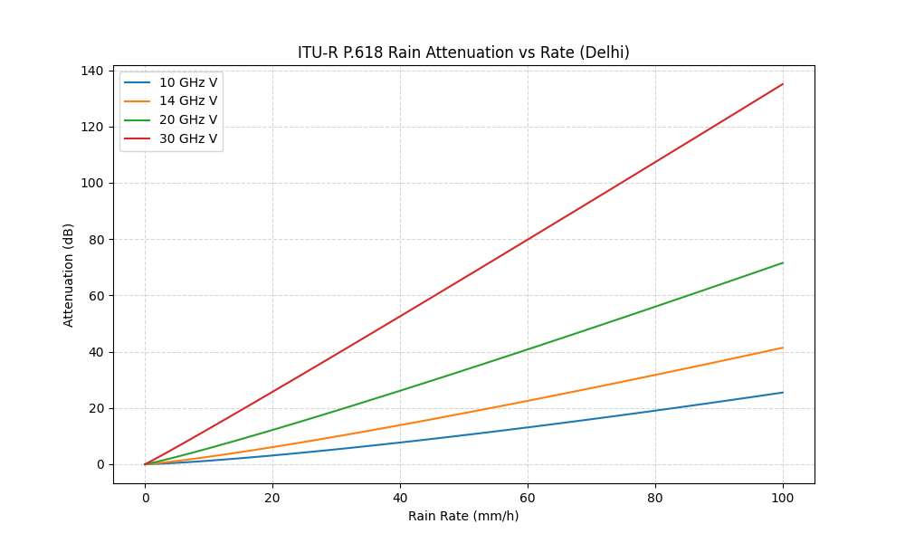
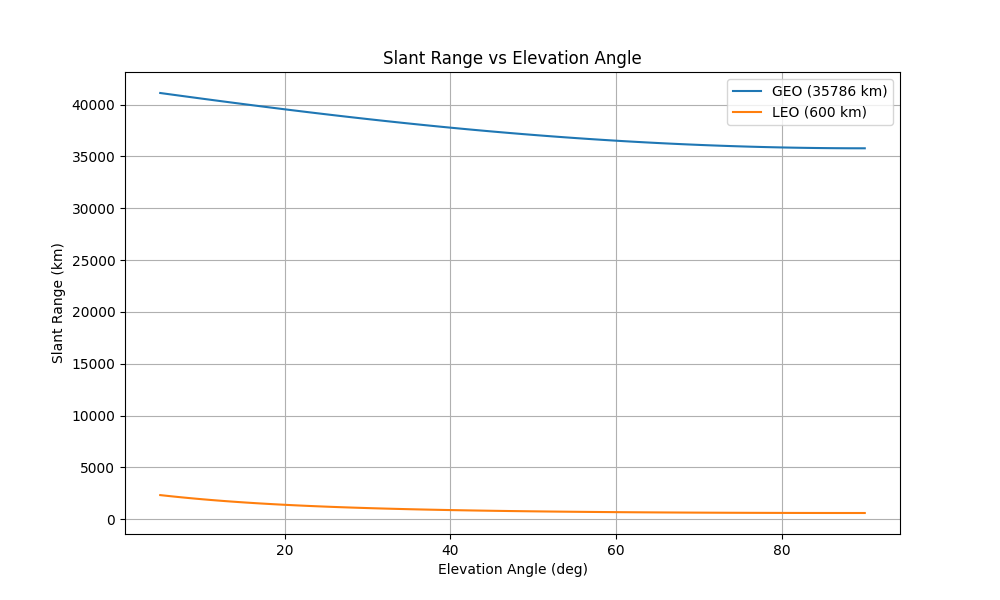
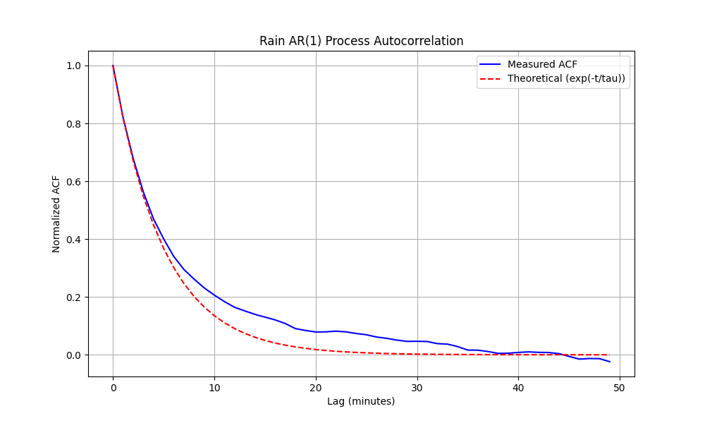

# Validation Methodology

The simulator utilizes a multi-layered approach to ensure physical accuracy and architectural reliability, combining analytical verification against ITU-R standards with an automated suite of regression and parallelism tests.

## Validation Summary

| Category | Component | Reference | Result |
|:---|:---|:---|:---|
| **Analytical** | FSPL | ITU-R P.525 | <1e-4 dB error |
| | Rain Attenuation | ITU-R P.838/P.618 | Matches analytical reference curves |
| | Geometry | Analytical GEO model | Consistent slant-range calculations |
| | AR(1) Rain | ITU-R P.1853 | Expected autocorrelation decay |
| **Automated** | Physics Invariants | Physical Laws | All invariants passed |
| | Regression | Deterministic Seeds | Bit-identical reproducibility |
| | Parallelism | Concurrent Engines | Serial and parallel outputs match |

---

## Analytical Validation

The following sections detail the verification of core physical models against ITU-R analytical references.

### 1. Free-Space Path Loss (FSPL)
Validated against the standard formula: $L_{fs} = 92.45 + 20\log_{10}(f_{GHz}) + 20\log_{10}(d_{km})$. 
The implementation maintains numerical precision within $10^{-4}$ dB across all operational frequencies (10–30 GHz) and slant ranges (35,000–45,000 km).

### 2. Rain Attenuation
- **Coefficients:** Specific attenuation coefficients ($k, \alpha$) are verified via log-linear interpolation of ITU-R P.838-3 tables.
- **Rain Height:** Latitude-dependent model (P.839-4) tested for climate zone accuracy (e.g., Delhi at 4.58 km vs. Berlin at 3.32 km).

*Figure 1: Comparison of simulated rain attenuation against ITU-R P.838/P.618 analytical references across various rain rates.*

### 3. Geometry
- **Slant Range:** Analytical slant-range calculations were compared against closed-form geometric solutions at limiting cases (0°, 45°, and 90° elevation angles).
- **SGP4 Accuracy:** Cross-validation against analytical GEO geometry confirms that propagated positions remain consistent with expected geostationary behavior. 

*Figure 2: Validation of SGP4-derived elevation and slant range against static geometric benchmarks.*

### 4. AR(1) Rain Process
- **Autocorrelation:** Verified decay constant $\rho = e^{-dt/\tau_c}$ matches the 5-minute ($\sim 300\text{s}$) correlation time characteristic of convective rain cells. 
- **Stationary Distribution:** Long-run convergence to ITU-R P.837 lognormal mean ensures that simulated link availability matches climatological averages.

*Figure 3: Empirical autocorrelation of the Maseng-Bakken process showing the expected exponential decay.*

---

## Automated Verification Suite

The project uses `pytest` to maintain technical integrity. These tests are executed automatically during development to prevent regressions.

### 1. Physics Invariants
Verifies that the simulator adheres to fundamental physical laws regardless of inputs:
- **Monotonicity**: FSPL must increase strictly with distance and frequency.
- **Scaling**: Thermal noise power must scale linearly with bandwidth ($k_B T B$).
- **Rain Power Law**: Attenuation must increase with rainfall intensity following the $kR^\alpha$ relationship.
- **Geometry**: Lower elevation angles must produce longer slant paths through the atmosphere.

### 2. Regression & Determinism
Ensures reproducibility and stable behavior across code versions:
- **Seed Integrity**: Validates that identical PRNG seeds produce bit-identical time-series results.
- **Control Flags**: Verifies that the `force_rain` flag correctly overrides probabilistic onset models.
- **Statistical Accuracy**: Checks that aggregate metrics (mean, std, p10) are calculated correctly from the time-series buffer.

### 3. Parallelism & Concurrency
Verifies correctness of the simulator's concurrency and parallel execution mechanisms:
- **Multiprocessing**: Ensures `run_monte_carlo` correctly distributes iterations across processes and aggregates results without data loss.
- **Async Integrity**: Validates that the asynchronous propagation layer returns results identical to the deterministic batched mode.
- **Concurrency Safety**: Checks for race conditions during simultaneous multi-station simulation runs.

---

## Validation Limitations
- Validation focuses on model correctness rather than field measurements.
- Atmospheric models are compared against ITU-R analytical references rather than live telemetry.
- SGP4 accuracy is dependent on the freshness of TLE data provided in the catalog.
