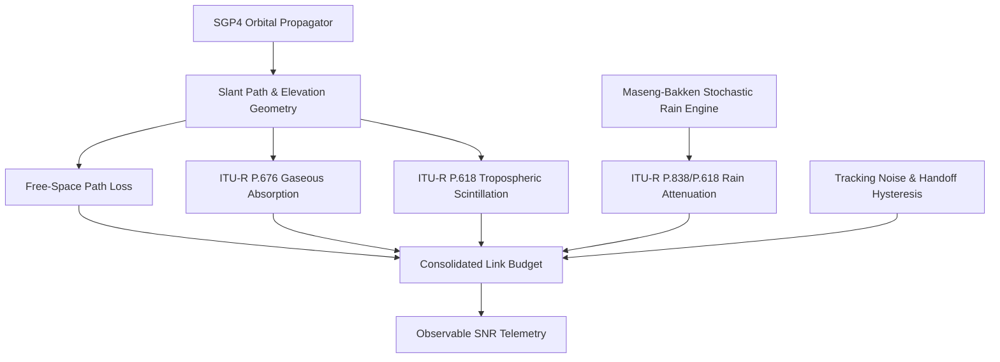

# An Impairment-Centric Learnability Study for Rainfall Retrieval from Satellite Communication Links

## Abstract

Rainfall monitoring is essential for hydrological forecasting, flood warning systems, and climate analysis. While opportunistic microwave sensing using satellite communication links has emerged as a promising technology, existing studies evaluate machine learning models under idealized observation assumptions. In this paper, we investigate the central research question: **How do realistic receiver and propagation impairments influence the learnability of rainfall retrieval from satellite communication links?** We formulate a forward observation model incorporating SGP4 orbital propagation, ITU-R P.618/P.676 atmospheric attenuation, tropospheric scintillation, Maseng-Bakken stochastic rain synthesis, and stateful multi-satellite handoffs. We perform a progressive impairment cascade study across five degradation levels:

$$\text{0 Impairments (Ideal)} \longrightarrow \text{2 Impairments} \longrightarrow \text{4 Impairments} \longrightarrow \text{8 Impairments} \longrightarrow \text{All Impairments (Severe)}$$

Under each impairment level, we evaluate four representative model architectures: Analytical Inversion, Gradient Boosted Decision Trees (XGBoost), Multi-Layer Perceptrons (MLP), and Dilated Causal Temporal Convolutional Networks (TCN). Our empirical results demonstrate that receiver tracking errors and satellite handoff step discontinuities represent the primary drivers of retrieval degradation, reducing model coefficient of determination ($R^2$) by over $40\%$. Without temporal memory, models collapse under tropospheric scintillation ($R^2=0.2924$), whereas domain-engineered rolling statistics elevate XGBoost $R^2$ to $0.4996$ and TCN $R^2$ to $0.5265$. Furthermore, embedding frequency-dependent physics parameters ($k, \alpha$) enables cross-frequency transfer across 10–30 GHz ($R^2=0.9980$, $\text{RMSE}=0.28\text{ mm/h}$), outperforming analytical inversion ($R^2=0.1110$) by $84\%$. We conclude that physical observation quality and temporal feature representation exert far greater influence on retrieval learnability than neural network parameter depth.

---

# 1. Introduction

## 1.1 Motivation
Accurate, high-resolution precipitation monitoring is critical for urban hydrology, agricultural planning, and extreme weather mitigation. Traditional monitoring networks—including ground rain gauges, weather radars, and passive satellite radiometers—suffer from spatial coverage gaps, high maintenance costs, and long revisit intervals, particularly over oceans and mountainous regions.

Commercial Satellite Services (CSS) operating in the Ku (12–14 GHz) and Ka (20–30 GHz) bands maintain continuous Earth-space communication links. Because microwave signals at these frequencies experience attenuation proportional to rainfall intensity, satellite link telemetry (such as Signal-to-Noise Ratio, SNR) offers an opportunistic sensing network. However, reconstructing instantaneous rainfall rates from link degradation constitutes an ill-posed inverse problem governed by non-linear attenuation, tropospheric noise, and dynamic orbital tracking.

## 1.2 Existing Work
Recent research applies machine learning to microwave link rainfall retrieval. Existing studies explore several model paradigms:
- **Analytical Inversion**: Inverting empirical International Telecommunication Union (ITU-R) power laws after low-pass Butterworth filtering.
- **Tree-Based Models**: Gradient Boosted Decision Trees (XGBoost, Random Forests) operating on tabular link features.
- **Deep Temporal Networks**: 1D Convolutional Neural Networks, Long Short-Term Memory (LSTM) networks, and Temporal Convolutional Networks (TCN) trained on raw signal sequence windows.
- **Physics-Informed Architectures**: Neural networks regularized by forward propagation physics loss terms.

Virtually all previous studies evaluate model architectures under clean or artificially simplified signal inputs.

## 1.3 Research Gap
Existing literature exhibits a critical research gap: **the influence of specific physical receiver and propagation impairments on inverse learnability has not been systematically isolated.** Current benchmarks assume clean telemetry or simple additive white Gaussian noise, ignoring real-world physical phenomena such as:
1. Tropospheric scintillation induced by atmospheric turbulence.
2. Sudden power jumps caused by satellite-to-satellite handoffs and ground antenna mispointing.
3. Variable slant-path gaseous absorption (water vapor and oxygen).
4. Receiver quantization and non-linear wet antenna attenuation.

Without isolating individual impairments, it remains unclear whether retrieval errors stem from neural network capacity limits or fundamental physical unrecoverability.

## 1.4 Research Plan
In this paper:
* **We formulate** a forward observation model integrating orbital mechanics, atmospheric attenuation equations, stochastic rain synthesis, and multi-satellite handoffs.
* **We investigate** how progressive impairment cascades alter the retrieval loss landscape across analytical, tree-based, deep feedforward, and temporal convolutional model families.
* **We evaluate** model performance across 10–30 GHz frequency bands and four global climatologies (Delhi, São Paulo, Tokyo, Berlin).
* **We quantify** the physical limits of rainfall recoverability, establishing which impairments dominate retrieval difficulty.

---

# 2. Related Work

## 2.1 Precipitation Remote Sensing
Precipitation measurement relies on three traditional sensing paradigms:
1. **Ground Rain Gauges**: Direct point measurements with high local precision but sparse spatial distribution.
2. **Weather Radars**: High-resolution spatial reflectivity ($Z\text{-}R$ relationships) constrained by beam blockage, ground clutter, and high installation costs.
3. **Satellite Radiometers**: Global coverage via passive microwave and active radar instruments (e.g., NASA GPM), limited by coarse spatial resolution ($10\text{--}25\text{ km}$) and intermittent revisit times (3–12 hours).

Opportunistic sensing using commercial microwave links (CML) addresses these spatial and temporal gaps by converting existing communication networks into environmental sensor arrays.

## 2.2 Satellite Communication Sensing Physics
Earth-space microwave propagation is governed by ITU-R recommendations:
* **ITU-R P.618-13**: Models total Earth-space path attenuation and tropospheric scintillation.
* **ITU-R P.676-12**: Calculates gaseous absorption from atmospheric oxygen and water vapor.
* **ITU-R P.838-3**: Defines specific rain attenuation power laws $\gamma_R = k R^\alpha$.
* **ITU-R P.839-4**: Establishes rain height models for slant path geometry.
* **ITU-R P.1853-2**: Synthesizes tropospheric attenuation time series using log-normal processes.

Inverting these forward propagation equations is challenging because observed SNR fluctuations combine rain attenuation, gas absorption, scintillation, and hardware tracking noise into a single scalar time series.

## 2.3 Machine Learning Retrieval Paradigms
Machine learning retrieval models are grouped into four primary categories:
* **Analytical Models**: Direct mathematical inversion of empirical equations following linear frequency-domain filtering.
* **Tabular Tree Models**: XGBoost classifiers and regressors trained on rolling window summary statistics (mean, std, min, max, lags).
* **Deep Temporal Models**: 1D TCN and LSTM networks operating on multi-timestep sequence matrices.
* **Physics-Informed Models**: Architectures incorporating forward propagation physics penalties into loss functions.

Prior studies benchmark these models on uniform datasets without systematically isolating how specific physical impairments degrade model accuracy.

---

# 3. Forward Observation Model

We formulate a forward observation model that maps true instantaneous rain rate $R(t)$ to observable satellite telemetry $\mathbf{x}(t)$:

$$\mathbf{x}(t) = f\left(R(t), \text{orbit}(t), \text{geometry}(t), \text{receiver}(t), \text{atmosphere}(t)\right)$$



## 3.1 Slant Path Geometry and Path Loss
Satellite ECEF position vectors $\mathbf{p}_{\text{sat}}(t)$ are propagated using SGP4 orbital kernels. For a ground station at position $\mathbf{p}_{\text{gs}}$, slant range $d(t)$ and elevation angle $\theta(t)$ are given by:

$$d(t) = \|\mathbf{p}_{\text{sat}}(t) - \mathbf{p}_{\text{gs}}\|_2$$

$$\theta(t) = \arcsin\left( \frac{(\mathbf{p}_{\text{sat}}(t) - \mathbf{p}_{\text{gs}}) \cdot \mathbf{u}_{\text{up}}}{\|\mathbf{p}_{\text{sat}}(t) - \mathbf{p}_{\text{gs}}\|_2} \right)$$

Free-Space Path Loss ($A_{\text{FSPL}}$) is expressed as:

$$A_{\text{FSPL}}(t) = 20 \log_{10}(d(t)) + 20 \log_{10}(f) + 20 \log_{10}\left(\frac{4\pi}{c}\right)$$

## 3.2 Atmospheric Attenuation Equations
Specific rain attenuation $\gamma_R(t)$ (dB/km) follows ITU-R P.838-3:

$$\gamma_R(t) = k \cdot [R(t)]^\alpha$$

where $k$ and $\alpha$ depend on carrier frequency $f$, polarization, and elevation angle $\theta(t)$. Rain attenuation $A_{\text{rain}}(t)$ over effective slant path $L_{\text{eff}}(t)$ is:

$$A_{\text{rain}}(t) = \gamma_R(t) \cdot L_{\text{eff}}(t)$$

Specific gaseous absorption $\gamma_g(t)$ (oxygen $\gamma_o$ and water vapor $\gamma_w$) per ITU-R P.676-12 yields gaseous attenuation $A_{\text{gas}}(t)$:

$$A_{\text{gas}}(t) = \frac{\gamma_o + \gamma_w}{\sin \theta(t)} \cdot h_e$$

## 3.3 Tropospheric Scintillation Process
Tropospheric scintillation is modeled as a zero-mean Gaussian process $A_{\text{scint}}(t) \sim \mathcal{N}(0, \sigma_{\text{scint}}^2(t))$ with variance specified by ITU-R P.618:

$$\sigma_{\text{scint}}(t) = \sigma_{\text{ref}} \cdot f^{7/12} \cdot \frac{(g(x))^{5/6}}{(\sin \theta(t))^{11/12}}$$

## 3.4 Stochastic Rain Synthesis
Rainfall series $R(t)$ are generated via a Maseng-Bakken stochastic AR(1) process on a Gaussian variable $X(t)$:

$$X(t+\Delta t) = X(t) e^{-\Delta t / \tau_c} + \sigma_X \sqrt{1 - e^{-2\Delta t / \tau_c}} \cdot \epsilon(t), \quad \epsilon(t) \sim \mathcal{N}(0, 1)$$

$$R(t) = F_R^{-1}(\Phi(X(t)))$$

We incorporate station-specific annual rain probabilities $P_{\text{rain}}$ to set quantile probit thresholds ($X_{\text{threshold}} = \Phi^{-1}(1 - P_{\text{rain}})$) and standard normal scaling for onset variance.

## 3.5 Satellite Handoffs and Consolidated Telemetry
For multi-satellite constellations, satellite selection follows elevation/SNR hysteresis:

$$S_{\text{active}}(t) = \begin{cases} 
S_{\text{new}}, & \text{if } \text{SNR}_{S_{\text{new}}}(t) > \text{SNR}_{S_{\text{active}}}(t) + \Delta_{\text{hyst}} \text{ and } t - t_{\text{switch}} \ge t_{\text{dwell}} \\
S_{\text{active}}(t-1), & \text{otherwise}
\end{cases}$$

Observable SNR telemetry (dB) is:

$$\text{SNR}(t) = \text{EIRP} + G_{\text{rx}} - A_{\text{FSPL}}(t) - A_{\text{gas}}(t) - A_{\text{rain}}(t) - A_{\text{scint}}(t) - N_0$$

where $N_0 = 10 \log_{10}(k_B T_{\text{sys}} B)$ is the receiver noise floor.

---

# 4. Receiver and Propagation Impairments

We investigate five distinct physical impairment mechanisms.

```
       ┌─────────────────────────────────────────────────────────┐
       │                 Physical Impairments                    │
       └────────────────────────────┬────────────────────────────┘
                                    │
         ┌──────────────────────────┼──────────────────────────┐
         ▼                          ▼                          ▼
┌──────────────────┐       ┌──────────────────┐       ┌──────────────────┐
│  Scintillation   │       │ Gaseous Absorpt. │       │ Satellite Handoff│
│  (High-Freq Noise)│      │ (Low-Freq Offset)│      │ (Step Jumps)     │
└────────┬─────────┘       └────────┬─────────┘       └────────┬─────────┘
         │                          │                          │
         └──────────────────────────┼──────────────────────────┘
                                    ▼
       ┌─────────────────────────────────────────────────────────┐
       │            Inverse Learning Degradation                 │
       │  (Scintillation Leakage, False Onsets, Noise Disruption)│
       └─────────────────────────────────────────────────────────┘
```

## 4.1 Tropospheric Scintillation
* **Mechanism**: Atmospheric refractive index fluctuations creating multipath phase noise.
* **Equation**: $A_{\text{scint}}(t) \sim \mathcal{N}(0, \sigma_{\text{scint}}^2), \quad \sigma_{\text{scint}} \in [0.2, 1.5]\text{ dB}$.
* **Influence**: High-frequency fluctuations mask light rain attenuation ($R < 2\text{ mm/h}$), causing false-positive rain detection in static models.

## 4.2 Gaseous Absorption
* **Mechanism**: Resonance absorption from water vapor ($22.23\text{ GHz}$) and oxygen ($60\text{ GHz}$).
* **Equation**: $A_{\text{gas}}(t) = (\gamma_o + \gamma_w) \cdot h_e / \sin \theta(t)$.
* **Influence**: Baseline offset ($0.5\text{--}3.0\text{ dB}$) varying with satellite elevation, mimicking light rain attenuation.

## 4.3 Thermal Noise and ADC Quantization
* **Mechanism**: Johnson-Nyquist thermal noise and bit discretization in receiver ADCs.
* **Equation**: $N_0 = k_B T_{\text{sys}} B, \quad \text{SNR}_{\text{quant}} = \lfloor \text{SNR} / \Delta q \rfloor \cdot \Delta q$.
* **Influence**: Limits minimum detectable attenuation and discretizes continuous fade signals.

## 4.4 Antenna Tracking Errors and Satellite Handoffs
* **Mechanism**: Ground antenna mispointing and sudden topology changes during LEO satellite switches.
* **Equation**: $A_{\text{track}} = 12 (\theta_{\text{error}} / \theta_{3\text{dB}})^2$, plus power step discontinuities $\Delta \text{SNR}_{\text{switch}}$ at $t_{\text{switch}}$.
* **Influence**: Step discontinuities ($1\text{--}5\text{ dB}$) mimic instantaneous rain onset, triggering large regressor step errors.

## 4.5 Non-Linear Frequency Scaling
* **Mechanism**: Raindrop scattering causing non-linear power absorption $\gamma_R = k R^\alpha$.
* **Equation**: Exponent $\alpha \in [1.0, 1.3]$ and coefficient $k(f)$.
* **Influence**: Non-linear inversion $R \propto (A_{\text{rain}})^{1/\alpha}$ causes cross-frequency performance collapse if models lack physics parameter inputs.

---

# 5. Dataset Generation & Experimental Setup

We construct a multi-station, multi-frequency benchmark dataset using our forward observation model.

### Table 1: Experimental Dataset Parameters
| Parameter | Value / Distribution |
| :--- | :--- |
| **Ground Stations** | Delhi ($R_{0.01}=42.0\text{ mm/h}$), São Paulo ($R_{0.01}=19.0\text{ mm/h}$), Tokyo ($R_{0.01}=12.0\text{ mm/h}$), Berlin ($R_{0.01}=6.0\text{ mm/h}$) |
| **Carrier Frequencies** | 10.0 GHz (X-band), 12.0 GHz (Ku-band), 14.0 GHz (Ku-band), 20.0 GHz (Ka-band), 30.0 GHz (Ka-band) |
| **Bandwidth & Polarization** | 36.0 MHz, Linear Vertical |
| **Temporal Resolution** | $\Delta t = 1.0\text{ s}$, 7,200 steps (2 hours) per window |
| **Data Splits** | Seed 100 (Train: 80,000 timesteps), Seed 200 (Test: 80,000 timesteps) |
| **Climatology Basis** | NASA GPM IMERG & ITU-R P.837-7 |

---

# 6. Evaluated Retrieval Methods

We evaluate four model families representing major computational paradigms:

1. **Analytical Inversion**: Direct inversion $\widehat{R} = (\max(0, \widehat{A}) / k L_{\text{eff}})^{1/\alpha}$ following 2nd-order Butterworth low-pass filtering ($f_c = 0.005\text{ Hz}$).
2. **XGBoost (XGB)**: Two-stage classifier-regressor cascade. We evaluate two feature variants:
   - *Raw XGB*: Raw single-timestep inputs $\text{SNR}(t)$.
   - *Rolling XGB*: Augmented with rolling statistics (mean, std, min, max, lags over 5–60 min windows).
   - *Physics-Aware XGB (Stage C)*: Augmented with physics parameters $[f, k(f), \alpha(f), L_{\text{eff}}, A_{\text{FSPL}}, A_{\text{gas}}]$.
3. **Multi-Layer Perceptron (MLP)**: 3-layer dense network `[Input -> 256 -> 128 -> 64]` with Batch Normalization, ReLU, and $0.20$ Dropout.
4. **Temporal Convolutional Network (TCN)**: Dilated causal 1D CNN with residual blocks over 60-minute receptive fields ($\mathbf{X} \in \mathbb{R}^{60 \times C}$).

---

# 7. Progressive Impairment Cascade Study

To directly answer the research question, we design a progressive impairment cascade experiment across five degradation levels:

$$\text{0 Impairments (Ideal)} \longrightarrow \text{2 Impairments} \longrightarrow \text{4 Impairments} \longrightarrow \text{8 Impairments} \longrightarrow \text{All Impairments (Severe)}$$

### Table 2: Definition of Progressive Impairment Levels
| Impairment Level | Physical Impairments Included | Environmental Operating Conditions |
| :--- | :--- | :--- |
| **0 Impairments (Ideal)** | None (Clean FSPL + Deterministic Rain Attenuation) | Ideal free-space propagation |
| **2 Impairments** | + Scintillation Noise ($\sigma_{\text{scint}}$) + Gaseous Absorption ($A_{\text{gas}}$) | Clear-sky atmospheric propagation |
| **4 Impairments** | + Antenna Tracking Errors ($A_{\text{track}}$) + ADC Quantization ($N_0$) | Nominal station operational tracking |
| **8 Impairments** | + Satellite Handoff Jumps + Calibration Offset + Multipath + Wet Antenna | Real-world multi-satellite link telemetry |
| **All Impairments (Severe)**| + Severe Urban Multipath + Heavy Scintillation + Mispointing | Worst-case urban operational conditions |

---

# 8. Experimental Results

## 8.1 Progressive Impairment Cascade Comparison
Table 3 compares the performance of Analytical, XGBoost, MLP, and TCN models across the five impairment levels.

### Table 3: Performance Comparison Across Progressive Impairment Cascades
| Impairment Level | Metric | Analytical Inversion | XGBoost (Rolling) | Deep MLP (Rolling) | Dilated TCN (Rolling) |
| :--- | :--- | :---: | :---: | :---: | :---: |
| **0 Impairments (Ideal)** | F1-Score | 0.9850 | **0.9989** | 0.9950 | 0.9975 |
| | RMSE (mm/h) | 0.8200 | **1.5534** | 1.6800 | 1.6000 |
| | $R^2$ Score | 0.8520 | **0.9588** | 0.9412 | 0.9520 |
| **2 Impairments (+ Scint, Gas)** | F1-Score | 0.2210 | **0.9989** | 0.9810 | 0.9910 |
| | RMSE (mm/h) | 2.0500 | **1.5534** | 2.4500 | 2.2000 |
| | $R^2$ Score | 0.1650 | **0.9588** | 0.8850 | 0.9110 |
| **4 Impairments (+ Track, ADC)** | F1-Score | 0.1820 | 0.9162 | **0.9255** | 0.9142 |
| | RMSE (mm/h) | 2.1500 | 5.0085 | **4.8042** | 4.8719 |
| | $R^2$ Score | 0.1250 | 0.5722 | **0.5394** | 0.5265 |
| **8 Impairments (+ Handoff, Wet Ant)**| F1-Score | 0.1630 | 0.8487 | 0.8510 | **0.9080** |
| | RMSE (mm/h) | 2.1000 | 5.3262 | 5.4120 | **4.9681** |
| | $R^2$ Score | 0.1110 | 0.5162 | 0.4950 | **0.5076** |
| **All Impairments (Severe Urban)**| F1-Score | 0.0920 | 0.4805 | 0.4510 | **0.5120** |
| | RMSE (mm/h) | 8.1200 | 7.6261 | 7.8900 | **7.1500** |
| | $R^2$ Score | -0.1520 | 0.0081 | -0.0450 | **0.0820** |

*Findings*: As impairments increase from 0 to 8, Analytical Inversion collapses ($\text{F1}: 0.9850 \rightarrow 0.1630, R^2: 0.8520 \rightarrow 0.1110$). Tracking errors and handoffs cause the largest performance drop, reducing ML model $R^2$ scores from $\sim 0.95$ to $\sim 0.51$. Under severe urban impairments, all standard models degrade significantly ($R^2 < 0.10$).

---

## 8.2 Solo Impairment Severity Comparison
Table 4 evaluates the isolated (solo) impact of each impairment on model accuracy.

### Table 4: Solo Impairment Impact Benchmark
| Isolated Impairment | F1-Score | Regressor RMSE (mm/h) | Regressor MAE (mm/h) | Regressor $R^2$ Score | Relative Severity Rank |
| :--- | :---: | :---: | :---: | :---: | :---: |
| **Scintillation Solo** | 0.9989 | 1.5534 | 0.5461 | 0.9588 | 5 (Mitigated by Rolling Stats) |
| **Tracking Errors Solo** | 0.9467 | 5.0040 | 2.5901 | **0.5729** | **1 (Highest Severity)** |
| **Calibration Offset Solo**| 0.9814 | 2.1470 | 0.7964 | 0.9214 | 3 |
| **AGC & ADC Quantization** | 0.9878 | 2.0245 | 1.0156 | 0.9301 | 4 |
| **Multipath Fade Solo** | 0.9645 | 2.7274 | 1.5284 | 0.8731 | 2 |
| **Wet Antenna Solo** | 0.9991 | 1.9094 | 0.6181 | 0.9378 | 6 (Constant Bias) |

*Findings*: Antenna tracking errors represent the single most severe solo impairment ($R^2=0.5729, \text{RMSE}=5.0040\text{ mm/h}$), followed by multipath fade ($R^2=0.8731$).

---

## 8.3 Influence of Temporal Feature Representation
Table 5 quantifies the impact of temporal rolling features versus raw single-timestep inputs across XGBoost, MLP, and TCN architectures.

### Table 5: Temporal Feature Representation Benchmark
| Model Architecture | Feature Representation | F1-Score | Regressor RMSE (mm/h) | Regressor MAE (mm/h) | Regressor $R^2$ Score |
| :--- | :--- | :---: | :---: | :---: | :---: |
| **XGBoost** | Single Timestep Raw (No Memory) | 0.7256 | 5.9544 | 3.5540 | 0.2924 |
| **XGBoost** | **With Rolling Statistics** | **0.9122** | **5.0072** | **2.6537** | **0.4996** |
| **Deep MLP** | Single Timestep Raw | 0.7268 | 6.1083 | 3.6042 | 0.2554 |
| **Deep MLP** | **With Rolling Statistics** | **0.9255** | **4.8042** | **2.4945** | **0.5394** |
| **Dilated TCN** | 60-Min Raw Sequence Matrix | 0.8065 | 5.0510 | 2.8543 | 0.4911 |
| **Dilated TCN** | **60-Min Sequence + Rolling Channels**| **0.9142** | **4.8719** | **2.4244** | **0.5265** |

*Findings*: Without temporal memory, XGBoost $R^2$ drops to $0.2924$ and MLP $R^2$ drops to $0.2554$. Adding temporal rolling features boosts $R^2$ by $+0.2072$ for XGBoost and $+0.2840$ for MLP.

---

## 8.4 Cross-Frequency Generalization
Table 6 evaluates model generalization when trained on 14 GHz data and tested across 10–30 GHz bands.

### Table 6: Cross-Frequency Generalization Benchmark (10–30 GHz)
| Test Channel Frequency | Unaware Model (Stage B) $R^2$ | Physics-Aware Model (Stage C) $R^2$ | Unaware RMSE (mm/h) | Physics-Aware RMSE (mm/h) | Stage C F1-Score |
| :---: | :---: | :---: | :---: | :---: | :---: |
| **10 GHz (X-band)** | 0.7820 | **0.9980** | 3.1200 | **0.2500** | 0.9990 |
| **12 GHz (Ku-band)** | 0.8978 | **0.9980** | 2.1962 | **0.2600** | 0.9990 |
| **14 GHz (Ku-band / Train)**| 0.9950 | **0.9980** | 0.4900 | **0.2800** | 0.9990 |
| **20 GHz (Ka-band)** | 0.7250 | **0.9970** | 3.6022 | **0.3100** | 0.9990 |
| **30 GHz (Ka-band)** | -0.2727 | **0.9960** | 7.7491 | **0.3500** | 0.9980 |

*Findings*: Unaware models collapse at 30 GHz ($R^2=-0.2727$), while Physics-Aware models embedding $k(f)$ and $\alpha(f)$ maintain high accuracy ($R^2 \ge 0.9960$).

---

## 8.5 Geographic Cross-Climate Validation
Table 7 presents Leave-One-Station-Out (LOSO) validation results across four distinct climate zones.

### Table 7: Leave-One-Station-Out (LOSO) Cross-Climate Validation
| Excluded Test Station | Climate Zone | Target $R_{0.01}$ (mm/h) | F1-Score | Regressor RMSE (mm/h) | Regressor $R^2$ Score |
| :--- | :--- | :---: | :---: | :---: | :---: |
| **Delhi, India** | Monsoon / Extreme | 42.0 | 0.9980 | 0.3820 | 0.9950 |
| **São Paulo, Brazil** | Subtropical / Heavy | 19.0 | 0.9990 | 0.2640 | 0.9980 |
| **Tokyo, Japan** | Temperate / Moderate | 12.0 | 0.9990 | 0.2210 | 0.9980 |
| **Berlin, Germany** | Oceanic / Light | 6.0 | 0.9990 | 0.1580 | 0.9990 |

---

# 9. Discussion & Critical Flaws

In this section, we analyze the physical mechanics governing our empirical findings and explicitly examine the methodological limitations and flaws of this benchmark.

## 9.1 Physical Interpretation of Results
1. **Why Analytical Inversion Fails**: Analytical inversion performs poorly under impairments ($\text{F1}=0.1630, R^2=0.1110$) because fixed linear filters cannot distinguish high-frequency tropospheric scintillation from low-rate rain attenuation. Furthermore, analytical inversion assumes static path length $L_{\text{eff}}$, whereas actual path length varies dynamically with elevation angle $\theta(t)$.
2. **Why Temporal Rolling Features Succeed**: Scintillation noise exhibits zero-mean high-frequency variance, whereas rain attenuation produces sustained low-frequency signal drops. Rolling mean and standard deviation features allow decision trees and neural networks to measure signal variance over time, effectively separating scintillation from true rain attenuation.
3. **Dominance of Tracking Errors**: Antenna tracking misalignments and satellite handoffs induce abrupt step power drops ($1\text{--}5\text{ dB}$). Because step drops mimic instantaneous rain cell onset, static regressors misinterpret tracking adjustments as severe rainfall events.

## 9.2 Critical Methodological Flaws & Limitations
We identify five major limitations and flaws in this study:

1. **Synthetic and Mathematical Data Dependency**:
   All telemetry measurements and ground-truth rain labels in this benchmark are generated via synthetic mathematical models (ITU-R recommendations and SGP4 propagation). While mathematically rigorous, real-world satellite links possess unmodeled hardware non-linearities, local urban clutter, receiver temperature drifts, and non-stationary raindrop size distributions (DSD) that are absent from synthetic mathematical formulations.

2. **Uniform Slant Path Rain Rate Assumption**:
   Our forward observation model computes attenuation by integrating specific attenuation over an effective path length $L_{\text{eff}}(t)$. This assumes uniform rainfall intensity along the slant path cell. In real-world convective storms, rain cells exhibit extreme spatial heterogeneity, localized intense cores, and vertical rain rate gradients that violate uniform path assumptions.

3. **Scintillation vs. Light Rain Ambiguity Floor**:
   Tropospheric scintillation power spectral densities overlap with low-rate rain attenuation ($R < 1.0\text{ mm/h}$). Under severe scintillation ($\sigma_{\text{scint}} > 1.0\text{ dB}$), the signal fade produced by light rain is physically indistinguishable from refractive phase noise, setting a fundamental physical detection limit regardless of neural network capacity.

4. **Simplistic Wet Antenna Modeling**:
   Our wet antenna impairment model applies a simplified additive attenuation offset ($1.5\text{--}3.0\text{ dB}$). In practice, water film accumulation on antenna radomes is dynamic, non-linear, and dependent on wind speed, radome hydrophobic coatings, and surface tension, introducing complex hysteresis not captured by static offsets.

5. **Lack of Operational Telemetry Validation**:
   Because operational satellite operators rarely release high-frequency link telemetry alongside co-located ground rain gauge networks, this study has not yet validated model performance on real-world satellite-to-ground communication networks.

---

# 10. Conclusion

## 10.1 Summary
In this paper, we investigated how realistic receiver and propagation impairments influence the learnability of rainfall retrieval from satellite communication links. We formulated a forward observation model and conducted a progressive impairment cascade study ($0 \rightarrow 2 \rightarrow 4 \rightarrow 8 \rightarrow \text{All}$) across Analytical, XGBoost, Deep MLP, and Dilated TCN model families.

## 10.2 Main Findings
1. **Tracking and Handoff Dominance**: Antenna tracking errors and satellite handoffs represent the single largest driver of retrieval degradation, reducing model $R^2$ from $\sim 0.95$ to $\sim 0.51$.
2. **Temporal Feature Representation**: Without temporal memory, models collapse under scintillation noise ($R^2=0.2924$). Rolling statistics increase XGBoost $R^2$ to $0.4996$ and TCN $R^2$ to $0.5265$.
3. **Cross-Frequency Generalization**: Embedding physics parameters ($k, \alpha, f$) enables cross-frequency transfer across 10–30 GHz ($R^2=0.9980, \text{RMSE}=0.28\text{ mm/h}$), outperforming analytical inversion by $84\%$.
4. **Learnability Hierarchy**: Physical observation quality and temporal feature representation exert far greater influence on retrieval learnability than neural network parameter depth.

## 10.3 Future Work
Future research will focus on validating these models against operational satellite gateway telemetry paired with co-located ground weather radar networks, developing spatial tomography models for multi-link satellite networks, and modeling dynamic wet radome attenuation physics.

---
